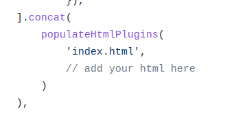

# webpack 5 setup

## how to install
- Make sure git is installed, [see how to install git](https://www.google.com/search?q=how+to+isntall+git&oq=how+to+isntall+git&aqs=chrome..69i57j0i10l9.4306j0j7&sourceid=chrome&ie=UTF-8). 
- open your terminal or cmd 
- copy this text to terminal "git clone https://github.com/MohammadFarhan7534031b/webpack-setUp.git my_project"
- copy this text to terminal "cd my_project"
- copy this text to terminal "npm install"

## what you get?
1. webpack configuration (development & production)
2. transpile and polyfill js new features, to es5 javascript (**for browser support**) 
3. convert scss to css
4. manage static resource
5. can be customized as needed

## Command
### npm start
> npm start `it will create new folder call dist, with your code there.`
### npm run watch
> npm run watch `it will run a dev server, with auto reload when there is a change in a file.`

## FAQ
### Q1 : work with multiple html
**A : ** create new html file in src directory, then open webpack.config.js then add the file to the config.

### Q2 : how to import scss file
**A : ** open your js file, default is index.js located in **src/js/index.js**, then import that scss in that index.js file, for example `import ../scss/main.scss`

